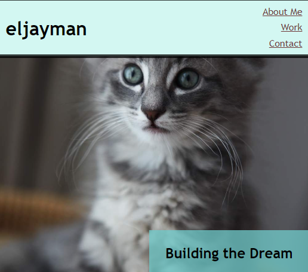

# Professional Portfolio

## Description

This website is built with HTML and CSS. It was created to practice creating HTML and CSS from scratch. I learned to use different elements in concert to make a page that is has the layout of the challenge example. The mobile version moves some of the elements into a column layout for ease of use. Upon expanding the window size, it will resemble the example more directly.

I learned about a lot of CSS elements and aspects of HTML design in order to make the best use of these types in concert to make appealing designs.

The next iteration will be even better!

## Screenshot

## Usage

Go to "https://eljayman.github.io/02-challenge-professional-portfolio/" and say, "hello kitty!"
